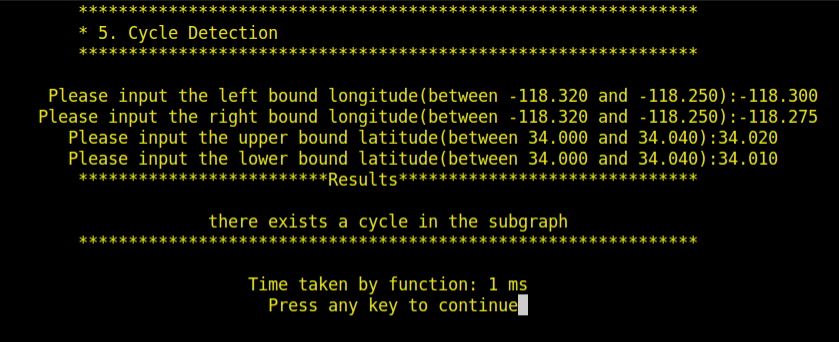

# TrojanMap

This project focuses on using data structures in C++ and implementing various graph algorithms to build a map application.

<p align="center"></p>

- Please clone the repository, look through [README.md](README.md).
- Please make sure that your code can run `bazel run/test`.

---

## The data Structure

Each point on the map is represented by the class **Node** shown below and defined in [trojanmap.h](src/lib/trojanmap.h).

```cpp
class Node {
  public:
    Node(){};
    Node(const Node &n){id = n.id; lat = n.lat; lon = n.lon; name = n.name; neighbors = n.neighbors; attributes = n.attributes;};
    std::string id;    // A unique id assign to each point
    double lat;        // Latitude
    double lon;        // Longitude
    std::string name;  // Name of the location. E.g. "Bank of America".
    std::vector<std::string> neighbors;  // List of the ids of all neighbor points.
    std::unordered_set<std::string> attributes;  // List of the attributes of the location.
};
```

---

## Prerequisites

### OpenCV Installation

For visualization, we use OpenCV library.

Use the following commands to install OpenCV and other libarary.

### Other library Installations

For MacOS:
```shell
$ brew install cmake
$ brew install opencv
$ brew install ncurses
```

For Ubuntu:
```shell
$ cd **your project folder**
$ git clone https://github.com/opencv/opencv.git
$ sudo apt-get install cmake libgtk2.0-dev pkg-config
$ sudo apt install libcanberra-gtk-module libcanberra-gtk3-module
$ sudo apt-get install libncurses5-dev libncursesw5-dev
$ cp ubuntu/* ./
```

Next, type the following, but make sure that you set the **path_to_install_folder** to be the absolute path to the **install** folder under opencv.

```shell
$ cd opencv/
$ mkdir build install
$ cd build
$ cmake -D CMAKE_INSTALL_PREFIX=**path_to_install_folder** -D BUILD_LIST=core,highgui,imgcodecs,imgproc,videoio ..
$ make install
```

For example, if cloned this repo under "/Users/nikhil/github/TrojanMap", you should type:

```shell
$ cd opencv/
$ mkdir build install
$ cd build
$ cmake -D CMAKE_INSTALL_PREFIX=/Users/nikhil/github/TrojanMap/opencv/install -D BUILD_LIST=core,highgui,imgcodecs,imgproc,videoio ..
$ make install
```

---

## Run the program

Please run:

For MacOS,

```shell
$ bazel run src/main:main
```

For Ubuntu, you need to use the following command to prevent errors.
               
```shell
$ bazel run --cxxopt='-std=c++17' src/main:main
```

If everything is correct, this menu will show up.

```shell
TrojanMap
**************************************************************
* Select the function you want to execute.                    
* 1. Autocomplete                                             
* 2. Find the location                                        
* 3. CalculateShortestPath                                    
* 4. Travelling salesman problem                              
* 5. Cycle Detection                                          
* 6. Topological Sort                                         
* 7. Find Nearby                                              
* 8. Exit                                                     
**************************************************************
Please select 1 - 8:
```

## Test the program

In order to test the functionalities of our program, please run
```shell
$ bazel test tests:trojanmap_test
```

You can add your own testcases in the [trojanmap_test_student.cc](tests/trojanmap_test_student.cc) and run

```shell
$ bazel test tests:trojanmap_test_student
```

## Step 1: Autocomplete the location name

```c++
std::vector<std::string> Autocomplete(std::string name);
```

We consider the names of nodes as the locations. Upon typing a partial name of the location, a functionality is implemented that returns a list of possible locations with partial name as prefix.

Example:

Input: "Chi" \
Output: ["Chick-fil-A", "Chipotle", "Chinese Street Food"]

Example:

```shell
**************************************************************
* 1. Autocomplete                                             
**************************************************************

Please input a partial location:ch
*************************Results******************************
Chinese Street Food
Cheebos Burger
Chick-fil-A
Chase
Chevron 1
Chipotle
Chase Plaza Heliport
Chevron 2
Church of Christ
Chucks Chicken & Waffles
Chevron
**************************************************************
Time taken by function: 2 ms
```

## Step 2-1: Find the place's Coordinates in the Map

```c++
std::pair<double, double> GetPosition(std::string name);
```

Given a location name, our algorithm returns the corresponding latitude and longitude and marks the given location on the map. If the location does not exist, the algorithm returns (-1, -1). The algorithm is case-sensitive.

Example:

Input: "Target" \
Output: (34.0257016, -118.2843512)

```shell
**************************************************************
* 2. Find the position                                        
**************************************************************

Please input a location:Target
*************************Results******************************
Latitude: 34.0257 Longitude: -118.284
**************************************************************
Time taken by function: 1 ms
```

<p align="center"></p>

## Step 2-2: Check edit distance between two location names

```c++
int CalculateEditDistance(std::string name1, std::string name2);
```

When entering a location name that does not exist in the map, the map will determine whether the input can be replaced with a "similar name" or not. Similar names refer to the names that exist in the map with a smallest distance from the original input. The distance between two names A and B is the minimum number of operations required to convert A to B. There are 3 operations:
+ Insert a character
+ Delete a character
+ Replace a character

If the exact match is found, it will be shown on the map. Otherwise, the map will show the most similar name by using FindClosestName and print a warning. For example, if I type Rolphs, I should get a warning like "Did you mean Ralphs instead of Rolphs?"

Example:

Input: "Rolphs", "Ralphs" \
Output: 1

```c++
std::string FindClosestName(std::string name);
```

Example:

Input: "Rolphs"\
Output: "Ralphs"

```shell
**************************************************************
* 2. Find the location                                        
**************************************************************

Please input a location:Rolphs
*************************Results******************************
No matched locations.
Did you mean Ralphs instead of Rolphs? [y/n]y
Latitude: 34.0318 Longitude: -118.291
**************************************************************
Time taken by function: 2 ms
```

## Step 3: CalculateShortestPath between two places

```c++
std::vector<std::string> CalculateShortestPath_Dijkstra(std::string &location1_name,
                                               std::string &location2_name);
std::vector<std::string> CalculateShortestPath_Bellman_Ford(std::string &location1_name,
                                               std::string &location2_name);
```

Given 2 locations A and B, an algorithm finds the best route from A to B. The distance between 2 points is the euclidean distance using latitude and longitude. Algorithms implemented include the Dijkstra algorithm and the Bellman-Ford algorithm. The routes are also displayed on the map. If there is no path, an empty vector is returned.

Example:

Input: "Ralphs", "ChickfilA" \
Output: ["2578244375", "5559640911", "6787470571", "6808093910", "6808093913", "6808093919", "6816831441",
      "6813405269", "6816193784", "6389467806", "6816193783", "123178876", "2613117895", "122719259",
      "2613117861", "6817230316", "3642819026", "6817230310", "7811699597", "5565967545", "123318572",
      "6813405206", "6813379482", "544672028", "21306059", "6813379476", "6818390140", "63068610", 
      "6818390143", "7434941012", "4015423966", "5690152766", "6813379440", "6813379466", "21306060",
      "6813379469", "6813379427", "123005255", "6807200376", "6807200380", "6813379451", "6813379463",
      "123327639", "6813379460", "4141790922", "4015423963", "1286136447", "1286136422", "4015423962",
      "6813379494", "63068643", "6813379496", "123241977", "4015372479", "4015372477", "1732243576",
      "6813379548", "4015372476", "4015372474", "4015372468", "4015372463", "6819179749", "1732243544",
      "6813405275", "348121996", "348121864", "6813405280", "1472141024", "6813411590", "216155217", 
      "6813411589", "1837212103", "1837212101", "6820935911", "4547476733"]

```shell
**************************************************************
* 3. CalculateShortestPath                                    
**************************************************************

Please input the start location:Ralphs
Please input the destination:Target
*************************Dijkstra*****************************
*************************Results******************************
"2578244375","5559640911","6787470571","6808093910","8410528464","8410528457","6808093913","6808093919","6816831441","6813405269","6816193784","6389467806","6816193783","123178876","2613117895","122719259","6807243574","6807243576","213332111","441895337","441895335","122719255","2613117893","6813405231","6813405237","6813405235","6047197523","6813379584","5237417650",
The distance of the path is:0.823773 miles
**************************************************************
Time taken by function: 23 ms

*************************Bellman_Ford*************************
*************************Results******************************
"2578244375","5559640911","6787470571","6808093910","8410528464","8410528457","6808093913","6808093919","6816831441","6813405269","6816193784","6389467806","6816193783","123178876","2613117895","122719259","6807243574","6807243576","213332111","441895337","441895335","122719255","2613117893","6813405231","6813405237","6813405235","6047197523","6813379584","5237417650",
The distance of the path is:0.823773 miles
**************************************************************
Time taken by function: 3484 ms
```

<p align="center"></p>

## Step 4: The Travelling Trojan Problem (AKA Travelling Salesman!)

In this section, we assume that we are using a UAV which means we can fly directly from 1 point to another point. Given a vector of location ids, we implement an algorithm that finds the shortest route that covers all the locations exactly once and goes back to the start point. This shortest path is then shown as an animation on the map. 

The following algorithms are used:

- Brute-force (i.e. generating all permutations, and returning the minimum)
```c++
std::pair<double, std::vector<std::vector<std::string>>> TravellingTrojan_Brute_force(
      std::vector<std::string> location_ids);
```
- Brute-force enhanced with early backtracking
```c++
std::pair<double, std::vector<std::vector<std::string>>> TravellingTrojan_Backtracking(
      std::vector<std::string> location_ids);
```
- [2-opt Heuristic](https://en.wikipedia.org/wiki/2-opt). Also see [this paper](http://cs.indstate.edu/~zeeshan/aman.pdf)
```c++
std::pair<double, std::vector<std::vector<std::string>>> TravellingTrojan_2opt(
      std::vector<std::string> location_ids);
```

We use early backtracking when the current cost is higher than current minimum.

```shell
**************************************************************
* 4. Travelling salesman problem                              
**************************************************************

Please input the number of the places:8
"8201681442","6197156485","7786565237","6820972477","6807600525","1832234142","6819144993","1873055949",
Calculating ...
*************************Results******************************
TravellingTrojan_Brute_force
"8201681442","1873055949","6197156485","1832234142","6807600525","6819144993","7786565237","6820972477","8201681442",
The distance of the path is:7.94756 miles
**************************************************************
You could find your animation at src/lib/output.avi.          
Time taken by function: 59 ms

Calculating ...
*************************Results******************************
TravellingTrojan_Backtracking
"8201681442","6820972477","7786565237","6819144993","6807600525","1832234142","6197156485","1873055949","8201681442",
The distance of the path is:7.94756 miles
**************************************************************
You could find your animation at src/lib/output_backtracking.avi.
Time taken by function: 20 ms

Calculating ...
*************************Results******************************
TravellingTrojan_2opt
"8201681442","1873055949","6197156485","1832234142","6807600525","6819144993","7786565237","6820972477","8201681442",
The distance of the path is:7.94756 miles
**************************************************************
You could find your animation at src/lib/output_2opt.avi.     
Time taken by function: 0 ms
```

<p align="center"></p>

<p align="center"></p>

## Step 5: Cycle Detection

```c++
bool CycleDetection(std::vector<double> &square);
```

In this section, we use a square-shaped subgraph of the original graph by using four coordinates stored in ```std::vector<double> square```, which follows the order of left, right, upper, and lower bounds. 

Then we try to determine if there is a cycle path in the that subgraph. If it does, we return true and report that path on the map. Otherwise we return false.

Example 1:
```shell
Input: square = {-118.299, -118.264, 34.032, 34.011}
Output: true
```
Here we use the whole original graph as our subgraph. 
<p align="center"></p>

Example 2:
```shell
Input: square = {-118.290, -118.289, 34.030, 34.020}
Output: false
```
Here we use a square area inside USC campus as our subgraph
<p align="center"></p>

```shell
5
**************************************************************
* 5. Cycle Detection                                          
**************************************************************

Please input the left bound longitude(between -118.320 and -118.250):-118.299
Please input the right bound longitude(between -118.320 and -118.250):-118.264
Please input the upper bound latitude(between 34.000 and 34.040):34.032
Please input the lower bound latitude(between 34.000 and 34.040):34.011
*************************Results******************************
there exists a cycle in the subgraph 
**************************************************************
Time taken by function: 0 ms

5
**************************************************************
* 5. Cycle Detection                                          
**************************************************************

Please input the left bound longitude(between -118.320 and -118.250):-118.290
Please input the right bound longitude(between -118.320 and -118.250):-118.289
Please input the upper bound latitude(between 34.000 and 34.040):34.030
Please input the lower bound latitude(between 34.000 and 34.040):34.020
*************************Results******************************
there exist no cycle in the subgraph 
**************************************************************
Time taken by function: 0 ms
```
## Step 6: Topological Sort

```c++
std::vector<std::string> DeliveringTrojan(std::vector<std::string> &location_names,
                                            std::vector<std::vector<std::string>> &dependencies);
```
In this section, we assume that we are using a UAV which means we can fly directly from 1 point to another point. Topological Sort involves going through a list of locations on the map in a certain order. Hence, it is all about finding a feasible route given the list of location names and the dependencies between these locations.

For example, 

```shell
Input: 
location_names = {"Ralphs", "Chick-fil-A", "KFC"}
dependencies = {{"Ralphs","KFC"}, {"Ralphs","Chick-fil-A"}, {"Chick-fil-A", "KFC"}}
```

Here, ```{"Ralphs","KFC"}``` means
that Tommy must go to `Ralphs` prior to `KFC`.

The output will be:
```shell
Output: Ralphs  -> Chick-fil-A -> KFC
```
Also, we provide ```PlotPointsOrder``` function that can visualize the results on the map. It will plot each location name and also some arrowed lines to demonstrate a feasible route.

If no feasible route exists, we simply return an empty vector.

```shell
*************************Results******************************
Topological Sorting Results:
Ralphs
Chick-fil-A
KFC
**************************************************************
Time taken by function: 2 ms
```
<p align="center"></p>

In the user interface, we read the locations and dependencies from `topologicalsort_dependencies.csv` and `topologicalsort_locations.csv` to modify our input.

## Step 7: Find Nearby

Given a attribute name C, a location name L and a number r and k, the algorithm finds at most k locations in attribute C on the map near L(not including L) with the range of r and returns a vector of string ids. The order of locaitons go from nearest to farthest.

```c++
std::vector<std::string> TrojanMap::FindNearby(std::string attributesName, std::string name, double r, int k);
```
All attributes
```
'artwork', 'attraction', 'bakery', 'bank', 'bar', 'beauty', 'beverages', 'bicycle', 'bicycle_rental', 'bus_station', 'cafe', 'car', 'car_repair', 'car_wash', 'charging_station', 'childcare', 'clinic', 'clothes', 'confectionery', 'convenience', 'copyshop', 'dentist', 'department_store', 'driving_school', 'fabric', 'fast_food', 'food_court', 'fountain', 'fuel', 'gallery', 'hairdresser', 'hospital', 'hotel', 'library', 'marketplace', 'mobile_phone', 'museum', 'music', 'optician', 'parcel_locker', 'parking', 'pharmacy', 'place_of_worship', 'police', 'post_office', 'restaurant', 'school', 'shoe_repair', 'shoes', 'skate', 'social_facility', 'supermarket', 'theatre', 'tobacco', 'yes', 'yoga'
```


```shell
**************************************************************
* 7. Find Nearby                                    
**************************************************************

Please input the attribute:supermarket
Please input the locations:Ralphs
Please input radius r:10
Please input number k:10
*************************Results******************************
Find Nearby Results:
1 Trader Joes
2 Cal Mart Beer & Wine Food Store
3 Food 4 Less
**************************************************************
Time taken by function: 5 ms
```

<p align="center"></p>


